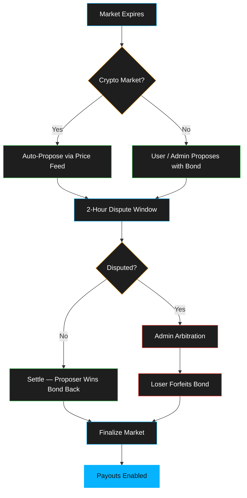
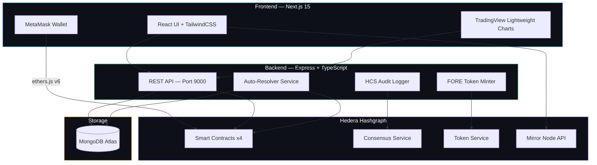
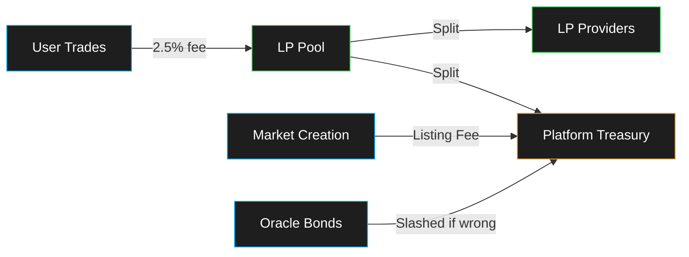

<div align="center">


<br/>
<br/>

# Foresight

### Decentralized Prediction Market Platform on Hedera Hashgraph

A full-stack decentralized prediction market with LMSR automated pricing,<br/>
optimistic oracle resolution, and immutable HCS audit trails.

[](https://hashscan.io)
[](https://nextjs.org)
[](https://typescriptlang.org)
[](https://soliditylang.org)
[](https://mongodb.com)

Built for the **Hedera Hello Future Apex Hackathon 2026** — Theme 2: DeFi & Tokenization

[Pitch Deck](https://drive.google.com/file/d/10xOyjlBnWTBelhwJqZnZi6h0b86uMDnF/view?usp=sharing) · [Demo Video](https://youtu.be/J_YThAfCS68) · [Live App](https://foresight-markets.vercel.app)

</div>

---

## About Foresight

Foresight is a decentralized prediction market platform built natively on Hedera Hashgraph. It allows anyone to create, fund, and trade on markets covering crypto prices, sports, politics, entertainment, and more. Users buy and sell outcome tokens whose prices reflect real-time probabilities, powered by an on-chain LMSR automated market maker.

Markets are resolved through an optimistic oracle system with bonded proposals and a 2-hour dispute window, ensuring trustless and fair outcomes. For crypto and tweet markets, the platform auto-resolves using live price feeds with zero human intervention. Every action across the platform is logged to a dedicated Hedera Consensus Service topic per market, creating an immutable, publicly verifiable audit trail.

The platform supports both binary (Yes/No) and multi-outcome markets with up to 10 custom outcomes per event. Community members provide liquidity to earn trading fees, and all participants earn FORE reward tokens (minted via Hedera Token Service) for creating markets, placing bets, and funding pools.

Foresight leverages five Hedera services: Smart Contract Service for on-chain LMSR and oracle logic, Token Service for the FORE reward token, Consensus Service for audit trails, Mirror Node API for free historical reads, and JSON-RPC Relay for gasless state queries.

---

## Platform Features

<table>
<tr>
<td width="50%">

**Binary Markets (Yes / No)**
- Single-question markets with two outcomes
- "Will BTC hit $100K by July 2026?"
- Prices represent real-time probability
- Auto-resolution for crypto price feeds

</td>
<td width="50%">

**Multi-Outcome Markets**
- 2–10 custom outcomes per event
- "Who will win the 2026 World Cup?"
- Each outcome has its own probability
- Grouped event UI with probability bars

</td>
</tr>
<tr>
<td>

**LMSR Automated Market Maker**
- Industry-standard LMSR algorithm
- Continuous pricing — no order book needed
- Unlimited token minting on demand
- Mathematically guaranteed solvency

</td>
<td>

**Optimistic Oracle Resolution**
- Bonded proposals with skin in the game
- 2-hour dispute window for challenges
- Economic slashing for incorrect answers
- Admin arbitration for disputed outcomes

</td>
</tr>
<tr>
<td>

**Community Liquidity Pools**
- Anyone can LP into a market
- Earn 2.5% of all trading volume as fees
- Add or remove liquidity anytime
- LP shares claimable after resolution

</td>
<td>

**HCS Immutable Audit Trail**
- Per-market Hedera Consensus Service topics
- Every action logged as timestamped JSON
- Verifiable on HashScan by anyone
- Auto-refreshing frontend audit log tab

</td>
</tr>
</table>

---

## Hedera Integration

This platform leverages Hedera Hashgraph across every layer of the stack.

### Smart Contracts — Hedera Testnet

| Contract | Address | Purpose |
|:---------|:--------|:--------|
| PredictionMarket | `0x61E76D8eD410aDc29EcF65aE697b7599eB17E97D` | Binary Yes/No market engine (LMSR) |
| OptimisticOracle | `0x506eA2BE51Daf38BBE1278cd836e799013fcC4Ed` | Oracle + dispute resolution (binary) |
| MultiOutcomeEvent | `0x5c678d1144Ea155Eb65176A6AC225DCB2e22B455` | Multi-outcome market engine (LMSR) |
| MultiOutcomeOracle | `0x8B25245D57a8965bb36D715442Fcd41CBE945EB6` | Oracle + dispute resolution (multi) |
| FORE Token (HTS) | `0.0.8139283` | Fungible reward token |

### Blockchain Services Used

| Service | Usage |
|:--------|:------|
| **Smart Contract Service** | 4 Solidity contracts with ABDKMath64x64 fixed-point math for on-chain LMSR |
| **Hedera Token Service** | FORE reward token — native minting, transfers, and association |
| **Hedera Consensus Service** | Per-market immutable audit topics with JSON message logging |
| **Mirror Node API** | Free reads for token balances, HCS history, and account resolution |
| **JSON-RPC Relay** | Free on-chain state queries via hashio.io — only writes cost gas |

---

## Quick Start

### Prerequisites

- Node.js 18+
- Hedera testnet account — [portal.hedera.com](https://portal.hedera.com)
- MetaMask wallet configured for Hedera Testnet
- MongoDB Atlas database

### 1. Clone the Repository

```bash
git clone https://github.com/ArhamKhan117/Foresight.git
cd Foresight
```

### 2. Backend

```bash
cd backend
npm install
cp .env.example .env       # Fill in Hedera credentials, contract addresses, MongoDB URL
npm run dev                 # Starts on http://localhost:9000
```

### 3. Frontend

```bash
cd frontend
npm install
cp .env.example .env.local  # Set NEXT_PUBLIC_API_URL and FORE_TOKEN_ID
npm run dev                  # Starts on http://localhost:3000
```

### 4. Smart Contracts (optional — already deployed)

```bash
cd contracts
npm install
cp .env.example .env
npx hardhat run scripts/deploy.js --network hedera_testnet
npx hardhat run scripts/deployMultiOutcome.js --network hedera_testnet
```

---

## Environment Variables

<details>
<summary><b>Backend</b> — <code>backend/.env</code></summary>
<br/>

| Variable | Description |
|:---------|:------------|
| `HEDERA_NETWORK` | `testnet` or `mainnet` |
| `HEDERA_OPERATOR_ID` | Hedera account ID (e.g. `0.0.6362296`) |
| `HEDERA_OPERATOR_KEY` | Hedera private key |
| `PREDICTION_MARKET_CONTRACT` | Binary market contract (EVM address) |
| `OPTIMISTIC_ORACLE_CONTRACT` | Binary oracle contract (EVM address) |
| `MULTI_OUTCOME_CONTRACT` | Multi-outcome event contract (EVM address) |
| `MULTI_OUTCOME_ORACLE_CONTRACT` | Multi-outcome oracle contract (EVM address) |
| `DB_URL` | MongoDB Atlas connection string |
| `FORE_TOKEN_ID` | HTS FORE reward token ID |
| `TWITTER_BEARER_TOKEN` | Twitter API v2 bearer token (for tweet markets) |
| `PORT` | Server port (default: `9000`) |

</details>

<details>
<summary><b>Frontend</b> — <code>frontend/.env.local</code></summary>
<br/>

| Variable | Description |
|:---------|:------------|
| `NEXT_PUBLIC_API_URL` | Backend API URL (e.g. `http://localhost:9000`) |
| `NEXT_PUBLIC_FORE_TOKEN_ID` | FORE token ID for balance display |

</details>

---

## How It Works

### Market Lifecycle


### LMSR Pricing

Industry-standard LMSR algorithm, implemented on-chain in Solidity:

```
Yes Price = e^(qYes/b) / (e^(qYes/b) + e^(qNo/b))
No Price  = e^(qNo/b)  / (e^(qYes/b) + e^(qNo/b))
```

- Prices always between 0 and 1 HBAR, always sum to 1
- Price = probability — Yes at 0.65 means 65% chance
- `b` parameter controls liquidity depth — more LP = less slippage
- Tokens minted on demand — no fixed supply cap


### Oracle Resolution Flow




**Bond Amounts:**

| Role | Bond | Context |
|:-----|:-----|:--------|
| Admin proposer | 2 HBAR | Trusted operator — low bond |
| User proposer | 10,000 HBAR | Skin in the game — slashed if wrong |
| Disputer | 10,000 HBAR | Counter-bond — slashed if dispute fails |

**Auto-Resolution (Crypto Markets):**

The backend auto-resolver polls every 60 seconds and handles the full lifecycle for crypto price/market cap markets — no human intervention needed:

1. Detects expired markets and submits oracle requests on-chain
2. Fetches live prices from CoinGecko and auto-proposes the outcome
3. Settles proposals after the 2-hour dispute window passes
4. Finalizes the market and updates the database
5. Force-closes markets stuck in oracle flow for 48+ hours
6. Closes expired PENDING markets that never reached funding

---

## HCS Audit Trail

Every market has a dedicated Hedera Consensus Service topic — an immutable, on-chain log of every action.

```mermaid
flowchart LR
    A[User Action] --> B[Backend Logs JSON to HCS Topic]
    B --> C[Hedera Consensus Timestamps Message]
    C --> D[Mirror Node Stores Immutably]
    D --> E[Frontend Reads via Mirror Node API]
    E --> F[User Verifies on HashScan]

    style A fill:#1e1e1e,stroke:#07b3ff,color:#fff
    style B fill:#1e1e1e,stroke:#07b3ff,color:#fff
    style C fill:#1e1e1e,stroke:#4cd964,color:#fff
    style D fill:#1e1e1e,stroke:#4cd964,color:#fff
    style E fill:#1e1e1e,stroke:#07b3ff,color:#fff
    style F fill:#07b3ff,stroke:#07b3ff,color:#111
```




**What Gets Logged:**

| Event | Data Recorded |
|:------|:-------------|
| Market / Event Created | Creator wallet, question, market type, outcomes |
| Market Funded | Funder wallet, HBAR amount |
| Bet Placed | Wallet, side, token amount, HBAR cost, outcome name |
| Oracle Requested | Requester wallet, market/event ID |
| Oracle Proposed | Proposer wallet, proposed answer |
| Oracle Disputed | Disputer wallet |
| Oracle Settled | Settler wallet |
| Market Resolved | Resolver wallet, winning result, resolution method |
| Market Force-Closed | Auto-resolver, reason (stale oracle / expired pending) |


**Topic Structure:**
- Binary markets — each market gets its own HCS topic
- Multi-outcome markets — one shared HCS topic per event (covers all outcomes)
- Frontend "HCS Audit Log" tab auto-refreshes every 30 seconds
- Each entry links to HashScan for independent verification
- Mirror Node reads are free — no gas, no HBAR cost

---

## FORE Reward Token (HTS)

Foresight uses Hedera Token Service to mint and distribute a native reward token called **FORE** (Foresight Reward).

| Property | Value |
|:---------|:------|
| Name | Foresight Reward |
| Symbol | FORE |
| Token ID | `0.0.8139283` |
| Decimals | 2 |
| Supply | Infinite (minted on demand) |
| Standard | HTS Fungible Token |

**Reward Schedule:**

| Action | FORE Earned |
|:-------|:------------|
| Create a market or event | 5 FORE |
| Place a bet (per trade) | 1 FORE |
| Fund a market (per HBAR contributed) | 2 FORE (capped at 50) |


- Rewards are fire-and-forget — they never block or fail the main action
- Users must associate the FORE token before receiving rewards (Hedera requirement)
- Frontend header shows FORE balance with auto-refresh via Mirror Node
- Fully visible on [HashScan](https://hashscan.io/testnet/token/0.0.8139283)

---

## Architecture



---

## Tech Stack

<table>
<tr>
<td width="33%" valign="top">

**Blockchain**
- Hedera Smart Contract Service
- Hedera Token Service (HTS)
- Hedera Consensus Service (HCS)
- Solidity 0.8 + ABDKMath64x64
- ethers.js v6

</td>
<td width="33%" valign="top">

**Frontend**
- Next.js 15 (App Router)
- TypeScript 5
- TailwindCSS
- TradingView Lightweight Charts
- MetaMask (Hedera EVM)

</td>
<td width="33%" valign="top">

**Backend**
- Node.js + Express
- TypeScript
- MongoDB Atlas
- @hashgraph/sdk
- CoinGecko API

</td>
</tr>
</table>


---

## Project Structure

```
Foresight/
├── frontend/                    # Next.js 15 application
│   ├── src/
│   │   ├── app/                 # App Router pages
│   │   │   ├── market/[id]/     # Market detail + trading + HCS tab
│   │   │   ├── propose/         # Market creation wizard
│   │   │   └── api/coingecko/   # CORS proxy for price feeds
│   │   ├── components/
│   │   │   ├── hedera_sdk/      # Contract ABIs + blockchain calls
│   │   │   ├── layouts/         # Header, footer, navigation
│   │   │   └── market/          # Market cards, charts, trading UI
│   │   └── config/              # API client + constants
│   └── next.config.ts
│
├── backend/                     # Express API + background services
│   ├── src/
│   │   ├── controller/          # Route handlers (market, oracle, profile)
│   │   ├── services/
│   │   │   ├── autoResolver.ts  # 60s polling — full oracle lifecycle
│   │   │   ├── hcsService.ts    # HCS audit trail logging
│   │   │   ├── htsService.ts    # FORE token minting
│   │   │   └── twitterService.ts
│   │   ├── hedera_sdk/          # Hedera SDK wrapper + contract calls
│   │   ├── model/               # MongoDB schemas
│   │   └── router/              # Express route definitions
│   └── package.json
│
├── contracts/                   # Solidity smart contracts
│   ├── src/
│   │   ├── PredictionMarket.sol # Binary LMSR market
│   │   ├── OptimisticOracle.sol # Binary oracle + disputes
│   │   ├── MultiOutcomeEvent.sol# Multi-outcome LMSR market
│   │   └── MultiOutcomeOracle.sol
│   ├── scripts/                 # Hardhat deploy scripts
│   └── hardhat.config.js
│
└── README.md                    # This file
```


---

## Revenue Model



| Revenue Stream | Description |
|:---------------|:------------|
| Trading Fees | 2.5% of every trade goes to the LP pool |
| LP Fee Share | Platform takes a portion of LP fees |
| Market Creation | Listing fees for market proposals |
| Oracle Bonds | Slashed bonds from incorrect proposals/disputes |
| FORE Token | Future utility and governance potential |

---

## Background Services

The backend runs three always-on services alongside the REST API:


| Service | Interval | What It Does |
|:--------|:---------|:-------------|
| **Auto-Resolver** | 60 seconds | Full oracle lifecycle — request, propose, settle, finalize, force-close stale markets, close expired pending markets |
| **HCS Logger** | On every action | Logs JSON messages to per-market Hedera Consensus Service topics |
| **FORE Minter** | On every action | Mints and distributes FORE reward tokens via Hedera Token Service |

The auto-resolver handles six distinct operations per cycle:

1. Submit oracle requests for expired active markets
2. Auto-propose outcomes for crypto markets using CoinGecko price feeds
3. Settle proposals after the 2-hour dispute window
4. Finalize resolved markets and update MongoDB
5. Force-close markets stuck in oracle flow for 48+ hours (safety net)
6. Close expired PENDING markets that never reached their funding goal

---

## Deployment

| Component | Platform | URL |
|:----------|:---------|:----|
| Frontend | Vercel | Auto-deploys from `main` branch |
| Backend | Railway | Auto-deploys from `main` branch |
| Database | MongoDB Atlas | Cloud-hosted cluster |
| Blockchain | Hedera Testnet | Contracts + HCS + HTS |


**Railway (Backend):**
- Build command: `npm install && npm run build`
- Start command: `npm start`
- Runs `node dist/index.js` in production
- Watch path: `/backend/**`
- Graceful error handling with `uncaughtException` / `unhandledRejection` handlers

**Vercel (Frontend):**
- Framework: Next.js (auto-detected)
- TypeScript errors ignored in build (`next.config.ts`)
- Environment variables set in Vercel dashboard

---

## On-Chain Proof

All contract interactions and audit trails are verifiable on HashScan:

| Asset | HashScan Link |
|:------|:-------------|
| PredictionMarket | [0x61E7...E97D](https://hashscan.io/testnet/contract/0x61E76D8eD410aDc29EcF65aE697b7599eB17E97D) |
| OptimisticOracle | [0x506e...C4Ed](https://hashscan.io/testnet/contract/0x506eA2BE51Daf38BBE1278cd836e799013fcC4Ed) |
| MultiOutcomeEvent | [0x5c67...B455](https://hashscan.io/testnet/contract/0x5c678d1144Ea155Eb65176A6AC225DCB2e22B455) |
| MultiOutcomeOracle | [0x8B25...5EB6](https://hashscan.io/testnet/contract/0x8B25245D57a8965bb36D715442Fcd41CBE945EB6) |
| FORE Token | [0.0.8139283](https://hashscan.io/testnet/token/0.0.8139283) |


---

## Why Hedera?

<table>
<tr>
<td width="50%">

**Performance**
- 10,000+ TPS with 3–5 second finality
- Predictable, low fees (~$0.001 per tx)
- No MEV, no front-running — fair ordering via hashgraph consensus

</td>
<td width="50%">

**Native Services**
- HTS for tokens without deploying ERC-20 contracts
- HCS for immutable audit trails without on-chain storage costs
- Mirror Node for free historical data queries

</td>
</tr>
<tr>
<td>

**EVM Compatibility**
- Full Solidity support via Hedera Smart Contract Service
- MetaMask and ethers.js work natively
- Free JSON-RPC reads via hashio.io relay

</td>
<td>

**Sustainability**
- Carbon-negative network
- Proof-of-stake consensus
- Energy-efficient hashgraph algorithm

</td>
</tr>
</table>

---

## Hackathon Submission

This project is built for the **Hedera Hello Future Apex Hackathon 2026** — Theme 2: DeFi & Tokenization.


**Key Highlights for Judging:**

| Criteria | Implementation |
|:---------|:---------------|
| Hedera Integration Depth | 4 smart contracts + HTS + HCS + Mirror Node + JSON-RPC Relay |
| Real-World Utility | Fully functional prediction market with real HBAR trading |
| Technical Complexity | LMSR AMM on-chain, optimistic oracle with disputes, auto-resolution |
| User Experience | Clean trading UI, real-time charts, one-click trading |
| Innovation | Multi-outcome markets, per-market audit trails, native reward token |

---

## Project Links

| Resource | Link |
|:---------|:-----|
| GitHub Repository | [github.com/ArhamKhan117/Foresight](https://github.com/ArhamKhan117/Foresight) |
| Pitch Deck | [Google Drive](https://drive.google.com/file/d/10xOyjlBnWTBelhwJqZnZi6h0b86uMDnF/view?usp=sharing) |
| Demo Video | [YouTube](https://youtu.be/J_YThAfCS68) |
| Live Website | [foresight-markets.vercel.app](https://foresight-markets.vercel.app) |

---

## License

ISC

---

<div align="center">
<br/>

**Foresight** — Decentralized prediction markets, built on Hedera.

<br/>

[](https://hedera.com)

</div>
